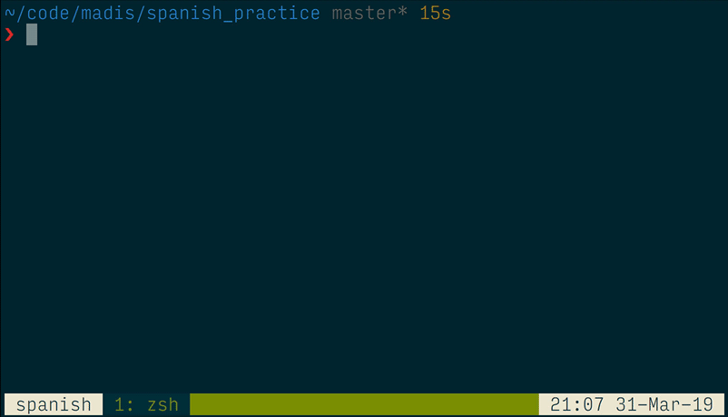

## Numbers

Run `./numbers` and you'll see:

```
❯ ./numbers.rb
¿Cómo se dice 37? treinta y siete
Correcto!
¿Qué numero es catorce? 14
Correcto!
¿Qué numero es diecisiete? 26
Incorrecto! Es 17
```

Demo:

[](https://youtu.be/OSau7uAeh7s)
> Click on link for video with sound
